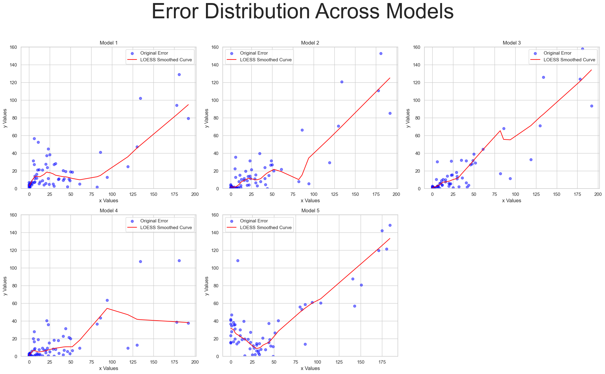
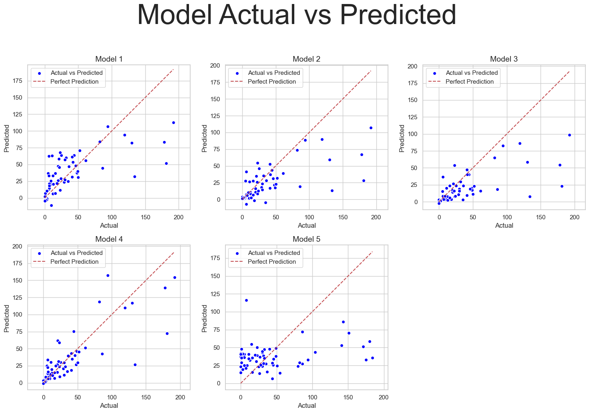
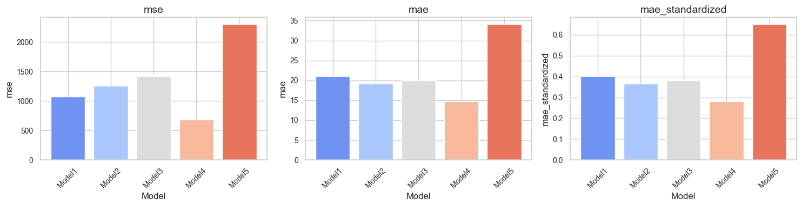

# NatureNet: 질병과 건강

## 개요
NatureNet은 기본적인 산불 및 감염병 예측 모델을 만들어 보는 프로젝트입니다. 공공 날씨 데이터를 활용해 산불, 감염병 발생 데이터를 예측하는 간단한 모델을 구현해 봤습니다.

## 데이터 출처
이 프로젝트에서는 다음의 공식 소스로부터 데이터를 사용합니다:

- **산불 피해 데이터**: 산림청 지표누리에서 제공하는 '산불피해현황' 데이터입니다. [여기](https://www.index.go.kr/unity/potal/main/EachDtlPageDetail.do?idx_cd=1309)에서 접근할 수 있습니다.

- **감염병 자료**: 질병보건통합관리시스템에서 제공하는 '법정 감염병 발생 현황' 데이터를 사용합니다. [여기](https://www.index.go.kr/unity/potal/main/EachDtlPageDetail.do?idx_cd=1442)에서 확인하세요.

- **기상 자료**: 기상청의 기상자료개방포털에서 제공하는 다양한 기후 관련 데이터를 활용합니다. [여기](https://data.kma.go.kr/climate/RankState/selectRankStatisticsDivisionList.do)에서 더 많은 정보를 얻을 수 있습니다.

## 주요 기능
- **기후 변화와 감염병 발생률 사이의 상관 관계 분석**
- **기후 변화와 산불 발생 횟수 사이의 상관 관계 분석**
- **모델 성능 평가를 위한 MSE, MAE 지표 시각화**
- **예측 결과와 실제 데이터 비교를 통한 예측 정확도 시각화**

## 모델 성능 평가
본 프로젝트에서는 다양한 성능 지표(MSE, MAE 등)를 사용하여 모델의 예측력을 평가합니다. 이러한 지표들은 모델의 강점과 약점을 이해하는 데 도움을 줄 수 있으며, 이를 바탕으로 한 시각화는 모델의 예측 성능을 직관적으로 파악할 수 있게 합니다.

### Error Distribution


### Actual vs Predict


### MSE, MAE, MAE_STANDARDIZED


## 프로젝트 구조
프로젝트는 두 개의 주요 주피터 노트북 파일로 구성됩니다:

- `analysis_disease.ipynb`: 기후 패턴과 역사적 질병 데이터를 바탕으로 감염병 발생을 예측하는 데 중점을 둡니다.

- `analysis_wild_fire.ipynb`: 다양한 환경 요인을 분석하여 산불 발생과 심각도를 예측합니다.

## 요구 사항
이 프로젝트는 Python 3.x와 다음 라이브러리가 필요합니다:
- TensorFlow
- NumPy
- Pandas
- Matplotlib
- Seaborn
- Scikit-Learn
- Statsmodels

필요한 라이브러리를 설치하려면 다음을 실행하세요:
```
pip install tensorflow numpy pandas matplotlib seaborn scikit-learn statsmodels
```

## 사용 방법
리포지토리를 클론
```
git clone 
```

주피터 랩이나 주피터 노트북에서 `analysis_disease.ipynb` 및 `analysis_wild_fire.ipynb`를 열고 셀을 순차적으로 실행하세요.

## 감사의 글
이 프로젝트에 사용된 중요한 데이터를 제공해 준 산림청, 질병보건통합관리시스템, 기상청에 감사드립니다.
